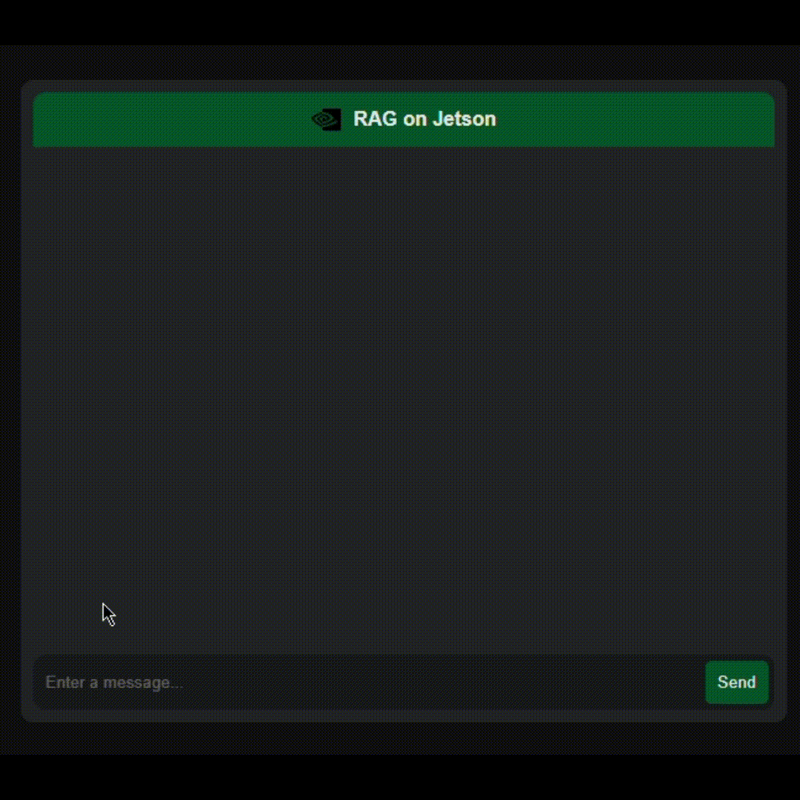

# 🚀 RAGJet: Retrieval-Augmented Generation on Jetson Xavier AGX (LLaMA + FastApi)

Welcome to **RAGJet**! This project focuses on implementing and optimizing Retrieval-Augmented Generation (RAG) models on the NVIDIA Jetson Xavier platform. Our goal is to leverage RAG, which combines the retrieval of relevant documents with generative models, to produce more accurate and contextually appropriate responses. By utilizing Jetson Xavier's high-performance AI computing, we aim to create asolution for edge-based applications where real-time data processing and inference are required.

As a proof of concept (PoC), we have specialized a large language model (LLM) on the reference documentation of the cuDNN library. This specialization enables the model to provide precise and context-aware responses specific to cuDNN. Furthermore, the model has been deployed within a FastAPI application, allowing for integration and interaction in a real-world scenario on the Jetson Xavier hardware.

## 📑 Table of Contents

- [Introduction](#introduction)
- [Key Features](#key-features)
- [Requirements](#requirements)
- [Usage](#usage)
- [Optimization Techniques](#optimization-techniques)
- [Contributing](#contributing)
- [License](#license)
- [Acknowledgments](#acknowledgments)

## 🤖 Demo of the RAGJet application answering a question related to the cuDNN library.

<center></center>

## 🌟 Introduction

**Retrieval-Augmented Generation (RAG)** is an advanced technique that combines the retrieval of relevant documents with generative models to produce contextually accurate responses. By integrating RAG with the NVIDIA Jetson Xavier, this project brings the power of these models to edge devices.

## 🛠️ Key Features

- **🔌 Integration:** Seamless integration of RAG models with the Jetson Xavier hardware.
- **🌐 Edge Computing:** Designed for low latency and high throughput on edge devices.
- **💬 Use Cases:** Perfect for conversational AI, real-time document retrieval, and more.
- **🤝 Community Driven:** Open-source project with opportunities for collaboration.

## 📋 Requirements

Before you begin, ensure you have met the following requirements:

- 🛠️ JetPack SDK installed (recommended version: 5.1 or higher)
- 🐍 Python 3.8 or higher
- 📦 Required Python packages (see `requirements.txt`)

## 🚀 Usage

1. **Clone the Repository:**

   ```bash
   git clone https://github.com/yourusername/ragjet.git
   cd ragjet
    ```

2. **Run the Docker Container:**

   ```bash
    docker run -it Docker/ --runtime nvidia -v /path/to/ragjet/src:/workspace
    ```
3. **Acess the application:**

   The application is now running on the Jetson Xavier device. You can access it by navigating to `http://your_jetson_ip:8883` in your web browser.

## ⚙️ Optimization Techniques
This project employs several optimization techniques to enhance the performance of RAG on Jetson Xavier:

* TensorRT Integration: Using NVIDIA's TensorRT for optimizing model inference.
* Model Pruning: Reducing the size of the model without sacrificing accuracy.
* Mixed Precision Training: Leveraging FP16 precision to speed up computations.

## 🤝 Contributing

Contributions are welcome! Please follow these steps to contribute to the project:

* Fork the repository.
* Create a new branch (git checkout -b feature/your-feature-name).
* Make your changes.
* Commit your changes (git commit -m 'Add some feature').
* Push to the branch (git push origin feature/your-feature-name).
* Open a Pull Request.

## License

This project is licensed under the MIT License.

## Acknowledgments
Special thanks to the open-source community and NVIDIA for their support and contributions to this project.
